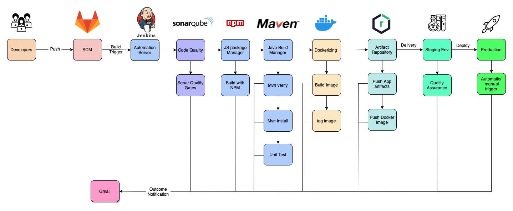

# CI/CD Pipeline
To streamline the software development process, I created a sufficient CI/CD pipeline by leveraging the capabilities of Docker Compose. Using Docker Compose, I was able to launch containers for various tools such as Jenkins, Nexus, SonarQube}, and GitLab. This allowed me to automate the entire pipeline, from building and testing the code (Generated by Jhipster Angular + Springboot) to deploying it to the production environment.



## Purpose:
The purpose of this documentation is to guide you through the steps to set up a CI/CD pipeline using:
- gitlab
- jenkins
- Maven
- Docker & Docker Compose
- SonarQube
- Nexus Sonatype
- Jhipster

## Walkthrough
The following sections provide a step-by-step guide to create an effective CI/CD pipeline.

### Step 1: Launch the container

The first step is to launch all the containers with Docker Compose. To do this, clone the repo and go to the docker-compose folder. Then, type the following command:

```
$ sudo docker-compose up -d
```
Note that to view the logs, you should not use the -d tag, and you should not close the terminal, or the containers will terminate.

### Step 2: Configuration
The next step is to configure Jenkins, GitLab, SonarQube, and Nexus Sonatype. To do this, follow these steps:

* Install the necessary plugins in Jenkins using the script by going to the script folder and typing:

```
$ bash installplugins.bash
```

If there are any issues with installing some plugins, you can install them manually in Jenkins.

* To get all the initial passwords, go to the script folder and type:

```
$ bash initialpasswords.bash
```

Note that after 24 hours, the passwords will expire, so you should store them somewhere.

Change the login password for each tool. Some of them will prompt you to change the password after putting in the initial user and password.

Integrate GitLab and Nexus and Sonar with Jenkins. You can follow the PDF in my repo. Note that there are images inside the img folder that show screenshots on how to do this.

### Step 3: Jenkinsfile

To create a pipeline, you need to create a Jenkinsfile. You can create one Jenkinsfile for each pipeline you need, such as Continuous Integration Pipeline, Daily Pipeline, and Continuous Deployment Pipeline. However, to simplify the process, we will create a single Jenkinsfile.

### Step 4: Creating the Pipeline

To create the pipeline, follow these steps:

* Go to the main dashboard -> new item -> pipeline.

* Configure triggers if needed, but we won't dive into that here.

* Copy the text from the Jenkinsfile (inside the jenkinsfile folder) into the section.

Note that you need to change the credentials for cloning the repo and the repo link. You also need the JHipster app in your Git repo. You will find it in mainapp-main.

* Apply and save.

### Step 5: Testing the Pipeline

To test the entire CI/CD pipeline, click on "build now," and you're done and of course if you configured the trigger correctly you can push to your repo and the pipeline will start.

### Step 6: Conclusion
By following the steps outlined in this documentation, you should now have an effective CI/CD pipeline in place. This pipeline will enable you to build, test, and deploy your software quickly and reliably, helping you to deliver high-quality software to your users faster than


